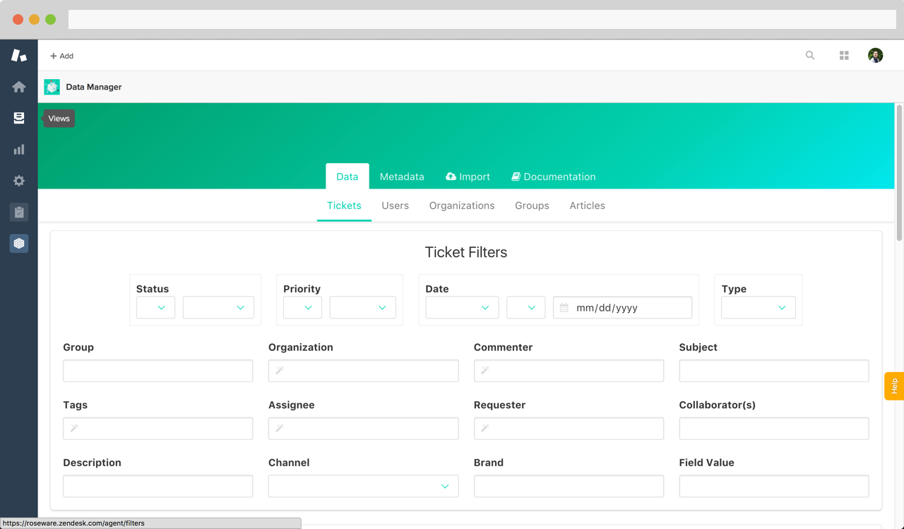

# Data Manager

> A Zendesk app for managing account data

| [](http://godban.github.io/browsers-support-badges/)</br>IE / Edge | [](http://godban.github.io/browsers-support-badges/)</br>Firefox | [](http://godban.github.io/browsers-support-badges/)</br>Chrome | [](http://godban.github.io/browsers-support-badges/)</br>Safari |
| --------- | -------------- | -------------- | --------------- |
| IE11, Edge| last 2 versions| last 2 versions| last 2 versions |



## Table of Contents
- [Development](#development)
  - [Build Setup](#build-setup)

## Development

Data Exporter is a Vue.js 2 app built on the Zendesk Apps Framework v2.0.

### Build Setup

``` bash
# Install dependencies
npm install

# Builds application
npm run build

# Run ZAT server, navigate to https://roseware.zendesk.com/agent/apps/data-manager?zat=true
cd app && zat server
```

---

&copy; Matthew Rosendin 2017. All rights reserved.
